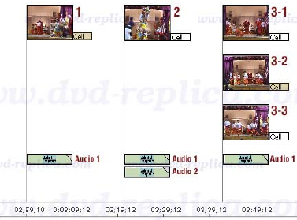
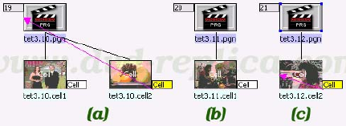
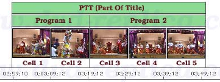
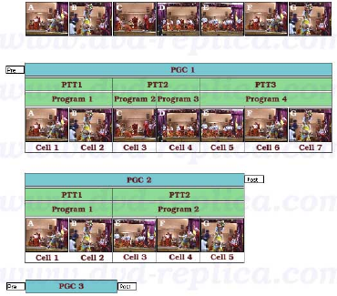
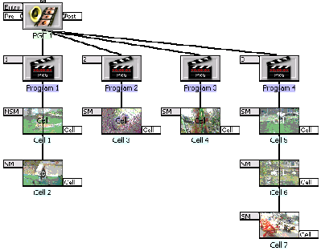
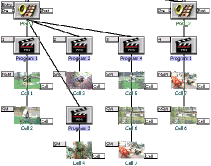
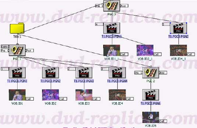

# Table of Contents

## [1. Cells](#1-cells-1)

### - Graphical display of Cells

## [2. Programs](#2-programs-1)

### - Graphical display of Programs

## [3. Chapters](#3-chapters-1)

### - Graphical display of Chapters

## [4. Program Chain (PGC)](#4-program-chain-pgc-1)

### - Example PGC usage

### - Graphical display of PGC

## [5. PGC in Titles](#5-pgc-in-titles-1)

## [6. PGC's in a language unit](#6-pgcs-in-a-language-unit-1)

### - Graphical display of Language Units

---

# 1. Cells

In the old days of VHS tape, a typical movie is recorded on a spool of tape to view from the beginning to the end in a sequential fashion. The movie actually is made up of many individual sequential segments of video scenes or film clips. The only interaction one can have with a VHS tape is rewinding and forwarding to the scenes of interest and play back. From the film editor's perspective, each individual scene is a basic building block, interconnecting with other scenes to produce the entire movie. In the DVD terminology, this individual scene is called a cell. Most if not all authoring packages require cells to contain a segment of video. The video may or may not have accompanied audio. From the DVD author's perspective, a cell is the smallest element of a DVD project. On each DVD, a cell is a unit of playback of real-time data and is uniquely identified by a set of numbers: cell identification or simply cell id (from 1 to 255) and Video Object Unit identification or simply VOB id (from 1 to 65535). The meaning of cells and video object units and the usage of cell id and VOB id are explained in subsequent sections.

The DVD specifications require the video and its optional audio component to be
recorded in specific data formats. A cell can be accessed randomly from any position of the DVD. The playback duration of a cell can be less than a second or several minutes long. Theoretically, a cell can contain an entire movie. At the end of the cell playback, a cell can request the DVD player to perform a specific task via its cell command. A cell command is a sequence of 8 bytes of binary data which can be one of the many commands provided by the DVD virtual command set. There are certain restrictions on cell commands depending upon where the cell is on the disc.

The DVD specifications define a set of virtual machine (VM) commands which can instruct the DVD player to set, verify certain playback conditions or user options, and navigate or modify the playback sequence accordingly. The presence of cell command is optional. This is how user interactivity is achieved. For example, a cell can play itself indefinitely until the user presses "stop" on the remote control. This is done by issuing a cell command to retart the playback of itself at the end of the cell. A cell command can request the DVD player to skip over a group of cells so that these video segments can never be played back even
though they exist on the DVD. The possibilities are endless.

A cell can optionally have a mask and highlight layer to simulate the behavior of a push button in menu selection and the highlighting of certain display items for interactive navigation. A cell is a very important DVD data structure with many roles and functions and will be explained in more details in subsequent sections.

There are two types of cells: single-angle and multi-angle cells. In the following example, the playback of cell 1 starts at 2 minutes, 59 seconds, and 10 frames after the disc is inserted into the DVD player. Similarly, cell 2 starts after 3 minutes and 19 seconds. Cell 1 and 2 are single-angle cells because they offer only one version or view (angle) of the video to play back. Cell 3 is a multi-angle cell since at the time line after 3 minutes and 39 seconds, one of the video versions 3-1, 3-2, or 3-3 can be played back depending upon the setting of the DVD player. The default selection of the video angle is usually initialized when the disc is inserted and can be changed in many ways, one of which is the use of cell command. A cell command is executed after the cell has been played back. Cell 1 and 3-2 (second angle) have cell commands. A cell can have one or more audio tracks independent of the video angle.

The playback between cells can be seamless or non-seamless. Seamless play refers to the smooth, uninterrupted, and continuous flow of sound and video images during the playback of a disc in a DVD player, with no noticeable pauses, breaks or jumps. Seamless play is preferable in most situations, but it is not possible in all situations due to the many constraints of the DVD technology, both in hardware limitations and the recorded data format. Non-seamless play means there is a momentarily pause or interruption in the flow of play. This usually occurs at the beginning of playing back a non-seamless cell. Cells that contain highlighting information for menu buttons are non-seamless by default. Non-seamless play is unavoidable in many situations which will be obvious in later sections of this guide.

## Graphical display of Cells

For future reference, this guide uses the following convention and graphics to display certain kinds of cells.

<table>
    <tr>
        <th></th>
        <th></th>
        <th></th>
    </tr>
    <tr>
        <td>
        A non-seamless cell is displayed as a rectangle with the label “NSM”. If the cell has cell command, the label “Cell” is shown in a colored background other than white. A cell is uniquely defined by its cell id and vob id. To clarify some complex examples, a text label such as “Cell 1” is used instead of the numeric cell id and vob id.
        </td>
        <td>
        A seamless cell is displayed as a rectangle with the text label “SM”. Whether a cell is seamless or non-seamless, a cell display implies one or more physical sectors on the DVD disc which include one video stream, up to eight audio streams, up to 32 sub-picture streams, and navigation information.
        </td>
        <td>
        A cell may contain a sub-picture layer with button highlighting information. The highlight layer may contain up to 36 menu buttons. The above display shows a cell having one or more buttons. Each menu button can contain one DVD virtual command. If a button has a command other than “Nop”, the label “Btns” is shown in colored background other than white.
        </td>
    </tr>
</table>

# 2. Programs

A sequence of one or more cells (within a program chain or `PGC`, explanations of `PGC` are covered in later section) with consecutive cell numbers can be defined as a program.

By default, the playback of a group of cells having no cell commands in a program are seamless. Programs are stored as an 8-bit pointer pointing to a group of cells within the same program chain. Programs are primarily used as units of playback for random or shuffle play, or references to groups of cells to be accessed via commands or chapter search (see the next topic). Many well-authored commercial movie DVDs assign only one cell per program. Programs which support multi-angle video always have multiple cells.

## Graphical display of Programs

For future reference, this guide uses the following convention and graphics to display certain kinds of programs.

<table>
    <tr>
        <th></th>
        <th></th>
        <th></th>
    </tr>
    <tr>
        <td>
        A program is simply an 8-bit pointer in a program chain (PGC) that points to a group of cells. A program may or may not be defined as a chapter. A program starts from 1 and can have a maximum value of 255 in each PGC. To clarify some complex examples, a text label such as “Program 1” is used instead of the program number. The group of cells which the program points to is displayed below its icon as shown above.
        </td>
        <td>
        If a program is defined as a chapter, the chapter number is displayed as a label on the left side of the program icon. A program may have up to 255 cells. A cell within a program having no cell command is seamless by default.
        </td>
        <td>
        The above illustration shows three programs. Program 1 and 3 are defined as the entries of chapter 1 and chapter 2, respectively.
        </td>
    </tr>
</table>

The following example shows typical usage of DVD programs.

In case (a), program 19 has two cells. The first cell does not contain cell commands so when its playback is finished, the second cell immediately begins its playback. The second cell contains a cell command to repeat the playback from the beginning of cell 1 (see LinkPGN later in this document). The label “Cell” of the second cell has a non-white background to indicate that the cell has a cell virtual command. A magenta arrow indicates the playback flow after the cell command is executed (going from one place to another). In this case, playback is directed to the program 19 or the beginning of the cell labeled “tet3.10.cell1”.

In case (b), program 20 has only one cell without cell command.

In case (c), program 21 has one cell with a cell command to repeat itself (see LinkCN).

Cases (a) and (c) are typical usage of cells to support menu with motion video background or a still menu with audio background where the looping back of a video or audio track is required.

# 3. Chapters

A sequence of one or more programs within a Program Chain or PGC (PGC is explained next), with consecutive program numbers can be defined as a Part-Of-Title or PTT. PTTs are commonly interpreted as chapters or called chapter stops, and are represented as units of random access provided to the user. Many authoring packages automatically assign one PTT for each program. In this case, each chapter corresponds to a program defined in the DVD project. The reason chapter is commonly referred to as Part-Of-Title will become obvious in the explanations of titles in subsequent section of this guide.

Chapters are stored in a data structure commonly known as a PTT table (outside the PGCs having the chapters) and will be presented in later section of this document.

## Graphical display of Chapters

If a program is defined as a chapter, the chapter number is displayed as a label on the left side of the program icon. In the above illustration, chapter 1 contains two programs labeled “01-t-scn-pg” and “02-t-scn-pg”. Chapter 2 has only one program labeled “02-t-scn-pg_1”. The first and third program has 2 cells. The second program has only one cell. Only the second cell labeled “02-t-scn-cell” is seamless.

# 4. Program Chain (PGC)

As previously explained, a cell is a basic unit of playback of video and audio data. Each cell is uniquely identified by its starting and ending sector address on the disc. A Program Chain (or PGC, contains a group of contiguous programs) defines the order in which cells are played back and how they are played back depending upon the current settings of the DVD player. One or more PGCs can be linked or chained together to form a video title (hence the term Program Chain).

When there are more than one PGC per title, one and only one of the PGCs is marked as a title-entry PGC. When a JumpTT is executed, the title-entry PGC is branched to (explanations of JumpTT is covered in subsequent sections). In simple movies, where one title has only one PGC, the cells recorded on the disc are played back in the same order as the cells in the PGC. If multiple titles corresponding to different stories in a title set are defined by their own PGCs, then each PGC will call out the cells to be played for that title. The order in which they are played may not be the same order as they are recorded on the disc. Because of this cell mapping, the DVD specifications allow the PGCs and cells to define the order sequence and time relationship of video and audio data playback to be completely arbitrary. This structure is used to provide playback options such as parental level selection, multi-angle viewing, subtitle selection, forced display, autoaction, etc.

Each PGC may have up to 128 pre-commands, which is executed before playing back the first cell in the PGC, and up to 128 post-commands, which is executed immediately after playing back the last cell in the PGC. The PGC may have cell commands, which can be executed each time a cell is played. The total number of commands (including pre, post, and cell commands) cannot exceed 128 commands per PGC. Through these commands and user interactions, one PGC can branch into other PGCs, multiple PGCs can branch into a single PGC, etc., providing a rich environment for interactive playback.

A PGC keeps a count of the number of programs and cells present in the PGC. If the number of programs/cells is 0, the PGC does not have any playback data and may contain only the pre or post commands. It is perfectly legal to have an empty PGC (having no cells and no command section) which does nothing. A PGC can be defined in this manner to direct and control the playback of video and audio data. A PGC contains bits that define Prohibited User Operations to disable certain user interactions during the playback of cells in the PGC. Each PGC has a color palette of 16 indexed colors. The values of these colors are recorded in the luminance and chrominance (component color format, YCrCb). Four indexed colors are used for subtitle, selection, action, and display color.

PGC is one of the major data structures of the DVD-Video format. More detailed
description of PGC and what information it contains are presented later in this document. The following illustration shows common configurations of PGC:

## Example PGC usage

> Tip:
> The Previous Track ( ⏮️ ) and ( ⏭ ) are used for Program Chain selection by the user.

### PGC 1 explanation

It contains:

- Pre-commands (These commands are executed before the cells are played back).
- 7 cells.
- 3 chapters.

### PGC 2 explanation

It contains:

- Post-commands (These commands are executed immediately after the playback of the last cell, which is cell 5)
- 5 cells.
- 2 chapters.

### PGC 3 explanation

It contains:

- Pre-commands (These commands are executed before the cells are played back).
- 0 cells.
- Post-commands (These commands are executed immediately after the playback of the last cell, which there's none, so it just executes; but after pre-commands of course).

PGC's like this which do not contain cells are used to direct and control the playback sequence of movie titles on the DVD.

## Graphical display of PGC

A PGC can have up to 128 pre-commands and post-commands. A PGC does not require to have pre or post commands. The pointers to the pre and post command section in the PGC are set to 0 if there are no commands in these sections. The label “Pre” is shown on the left of the PGC icon to indicate the pre-command section. The label “Post” is shown on the right side of the PGC icon to indicate the post-command section. If there are commands in the section, the background of the label is displayed in color other than white. From a hierarchy perspective, PGC is a level higher than the programs. In the above illustration, the PGC labeled “PGC 1” contains three chapters spanning four programs. Program 1, 2, 3, and 4 has 2, 1, 1, and 3 cells, respectively. All cells except the first are seamless.

The above illustration shows four chapters in two separate PGCs. Even though the chapter number is increased sequentially, the program number starts from 1 again for each PGC. Different PGCs may point to the same cells physically located on a DVD disc. In this scenario, both PGCs point to the same cells 6 and 7. Most authoring programs assign different labels to differentiate the same cells in different PGCs. Since the cells are uniquely identified by their vob id and cell id, PGCs have only pointers to these cells so actually no video, audio or other stream data are duplicated. Commercial DVDs usually have a large number of PGCs which point to the same set of cells so the DVD contents may appear larger than 9 Gbytes to confuse backup or copying tools.

# 5. PGC in Titles

A video title is often a unique sequence of video and audio contents. A typical DVD disc contains one or more titles. The longest title often is the main movie on a commercial DVD. A title may have more than one PGCs. PGCs that belong to the same title has the same title number in their header. From a hierarchy perspective, a title is a level higher than the PGCs.

In the following project, there are requirements to show the audience three choices of viewing different versions of a documentary video. The documentary video has five different topics. Each topic is organized as a cell. Each cell that represents the video and audio clip of the corresponding topic is uniquely identified by its vob id (a number from 1 to 65535). In the below illustration, the cells are labeled from vob.id1 to vob.id5.

A title containing three PGCs can be designed to allow three different choices of viewing. The first PGC (labeled “PGC 1”) presents the first choice of viewing. If this is the default choice, when the title is selected, PGC 1 will play back the cells labeled vob.id1, vob.id2, vob.id3, and vob.id4, in that order. PGC 1 is marked as the entry-PGC in the title so when the title is selected, the DVD player knows which PGC to select to begin playback. A title can have as many PGCs as needed, but there can be only one entry-PGC per each title.

PGC 1 has 4 programs (labeled t1.pgc1.pgn1 through t1.pgc1.pgn4). Each program contains only one cell. Program 1, 3, and 4 are marked as chapters 1, 2, and 3. Even though PGC 1 has 3 chapters, all programs within the PGC (hence all cells, labeled vob.id1 through vob.id4, in that order) are played back sequentially. Selecting chapter 2 while PGC 1 is playing back the first cell (labeled vob.id1) will start the playback of the third cell (labeled vob.id3) since the playback jumps from chapter 1 to 2. Most DVD player allows the selection of programs (commonly referred to as tracks) in a title by pressing the (Skip/Next) or (Skip/Previous) key on the remote control. If PGC 1 is playing the first cell, pressing (Skip/Next) starts the next program and the LCD display of the player still shows chapter 1. Pressing (Skip/Next) again to start program 3 and the LCD display shows chapter 2.

The second PGC (labeled PGC 2) presents the second choice of viewing. PGC 2 has 1 program (labeled t1.pgc2.pgn1) which has one cell (labeled vob.id5).

The third PGC (labeled PGC 3) presents the last choice of viewing. PGC 3 has 2 programs (labeled t1.pgc3.pgn1 and t1.pgc3.pgn2). The first program (labeled t1.pgc3.pgn1) has two cells which offers a different version of the cells in chapter 1 and is marked as chapter 4. The second program (labeled t1.pgc3.pgn2) has one cell and is marked as chapter 5. Pressing the (Skip/Next) on the remote control while PGC 1 is playing the last program (chapter 3) starts chapter 4 of the title (PGC 3, program 1 of this PGC). PGC 2 is present in the title but will not be played back. In other words, PGC 2 is invisible from the DVD player. The DVD author can add post commands to PGC 1 or PGC 3 to access PGC 2, or let the viewer access PGC 2 through a menu.

Most DVD players can locate a title, and individual chapters or programs in the title. Many remote control unit has the GoTo key to support the selection of available titles on the video disc. For instance, pressing GoTo and the number 1 on the keypad selects title 1. Most remote control unit has the Repeat key to repeat the playback of a title, a chapter, or a program.

In summary, chapters in a title are located by two unique items: the PGC in the title and the program in the specified PGC. Chapters are not restricted to be a part of one PGC. Since a title may contain more than one PGCs, chapter is seen as a part of a title (hence the term Part-Of-Title or PTT). The DVD specifications require the authoring software to create a structure holding the chapter or PTT information. Detailed information of this structure (VTS_PTT_SRPT, Part-Of-Title Search Pointer Information) is covered in later section of this document.

## Graphical display of titles and PGCs

The illustration above displays two yellow icons representing the titles labeled “Title 1” and “Title 2”. Theoretically, a title can have up to 64k PGCs, but the DVD specifications limit a title to a maximum of 999 PGCs. For most practical purposes, there are very few commercial movie DVDs having more than 250 PGCs per title. PGCs are numbered from 1 within each title. Each title must have at least one PGC and can have only one entry-PGC. A title is a global component in the sense that it can be linked to from any location on the DVD disc either directly or indirectly. There are virtual commands designed to operate on titles so any title can be located and linked to quickly. The DVD specifications permit up to 99 titles per disc.

# 6. PGC's in a language unit

A program chain (PGC) contains commands to direct playback. The DVD specifications impose restrictions on certain types of virtual machine commands which a PGC can have depending upon where the PGC resides. As previously explained, a group of PGCs can be chained together to create a title. The principal function of a video title is playing back the main movie features with minimum interaction from the viewer, so it makes sense to prohibit the execution of certain virtual commands when a title is being played back. For example, the command to set the parental management level is not allowed while a video title is being played back. This restriction reduces the possibility of command errors created by the authoring process and also lessen the hardware requirements to decode virtual commands by the DVD player. Virtual commands which support the highlighting and selection of menu buttons are available only for the PGCs which are a part of a defined structure called Language Unit.

A PGC in a language unit usually contains commands to perform interactions with menus to highlight and to select certain items on the menu. The DVD specifications allow a PGC to be one of the following predefined menus when it is a part of a language unit: title menu, root menu, subpicture menu, angle menu, audio menu, and chapter menu. Without these menu attributes, a PGC in a language unit has all other functions and properties of a standard PGC. There is practically no limit on the number of PGCs which can be present in a language unit, so additional menu PGCs can be created if the authoring project requires more than what the predefined menus offer. A video DVD can have as many language units as needed to provide the display of menus, the selection of subpicture and audio streams in the desired languages. Language units can be present only in the Video Manager (VMG) and the Video Title Set Menu (VTSM) domain.

Explanations of the VMG and VTSM domain are covered in subsequent sections of this guide. The section PGC Category has more information on the usage of predefined menus in language units with a standard remote control. Please also read Language Codes for a complete list of the languages supported by the DVD specifications.

## Graphical display of language units

From a hierarchy perspective, a language unit is a level higher than the PGCs. Language units are present in certain domains (domains are explained in the next section of this document), and cannot be present where a title exists. The following diagram shows the relationship between language units and PGCs.

In the above illustration, the first language unit is English with 3 PGCs: a root menu PGC (this PGC is played back when the Menu button on the remote control is pressed), an angle menu PGC (this PGC is played back when the Angle button on the remote control is pressed), and a menu PGC which is invoked by the post commands of the root menu of the language unit. The second language unit is Spanish with 2 PGCs: a title menu (this PGC is played back when the Title button on the remote control is pressed and the DVD player default language is Spanish), and a menu PGC. The third language unit is French with 6 PGCs: 5 predefined menu PGCs (predefined menus are discussed in more details later in this document) and one menu PGC.
